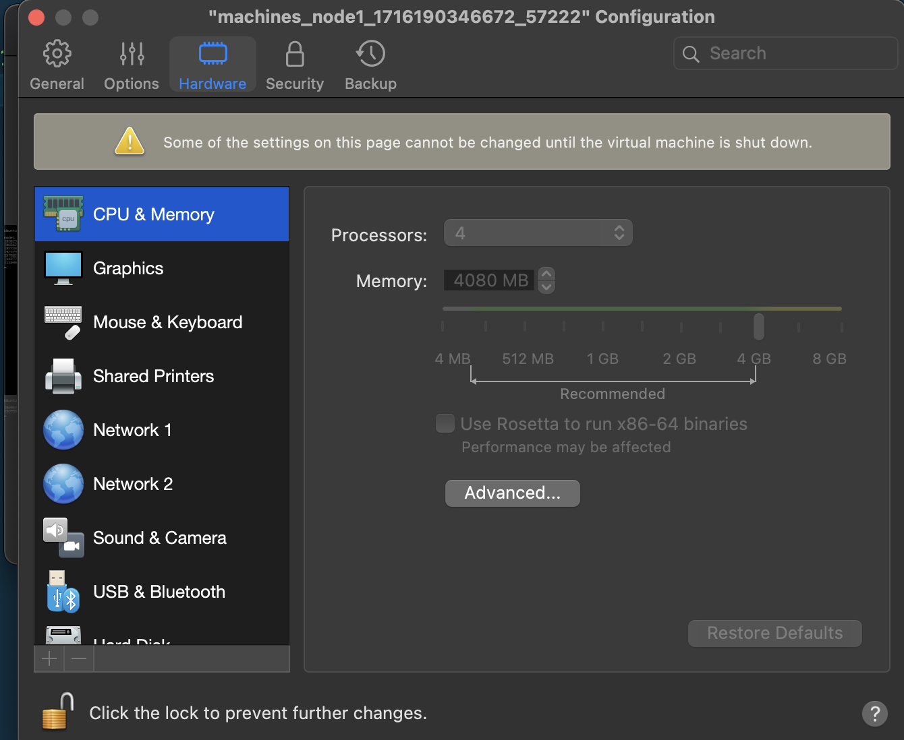

## Part 1. Ready-made manifest

#### 1. Run a Kubernetes environment with 4GB memory

#### 2. Apply the manifest from the /src/example directory to the created Kubernetes environment

> The project from docker hub doesn't work on my system cause I have arm architecture not amd

#### 2.1. So let's create my custom simple manifest

> ./src/example/nginx.yml

#### 3. Run the standard Kubernetes control panel with the minikube dashboard

#### 4. Create tunnels to access the deployed services with the command minikube services
#### 5. Check if the deployed application works by opening the application page in the browser (nginx service)
