## Part 1. Ready-made manifest

#### 1. Run a Kubernetes environment with 4GB memory
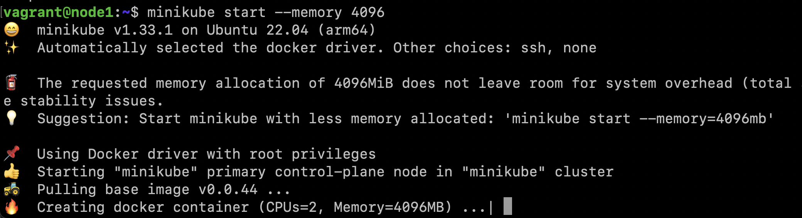

#### 2. Apply the manifest from the /src/example directory to the created Kubernetes environment
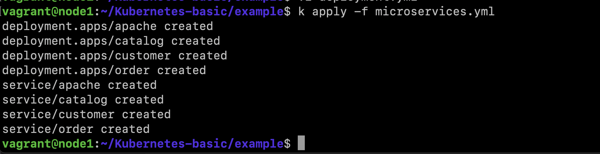
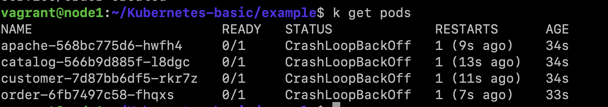

> The project from docker hub doesn't work on my system cause I have arm architecture not amd
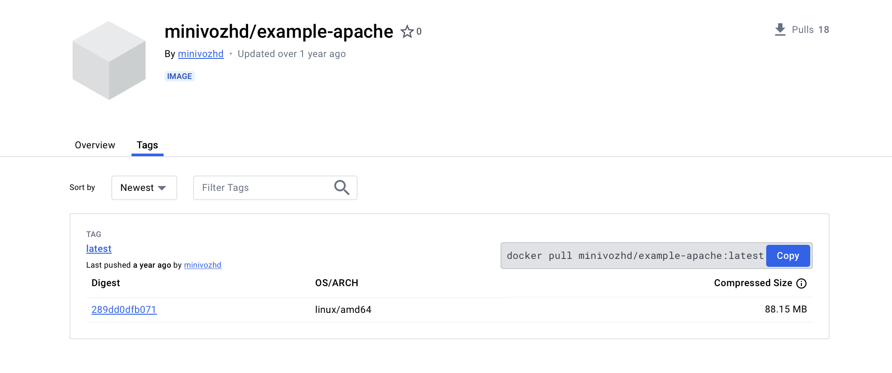
#### 2.1. So let's create my custom simple manifest
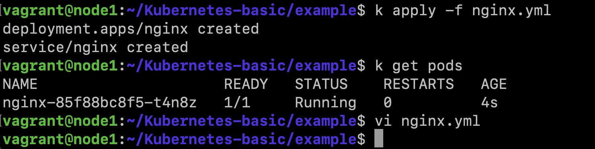
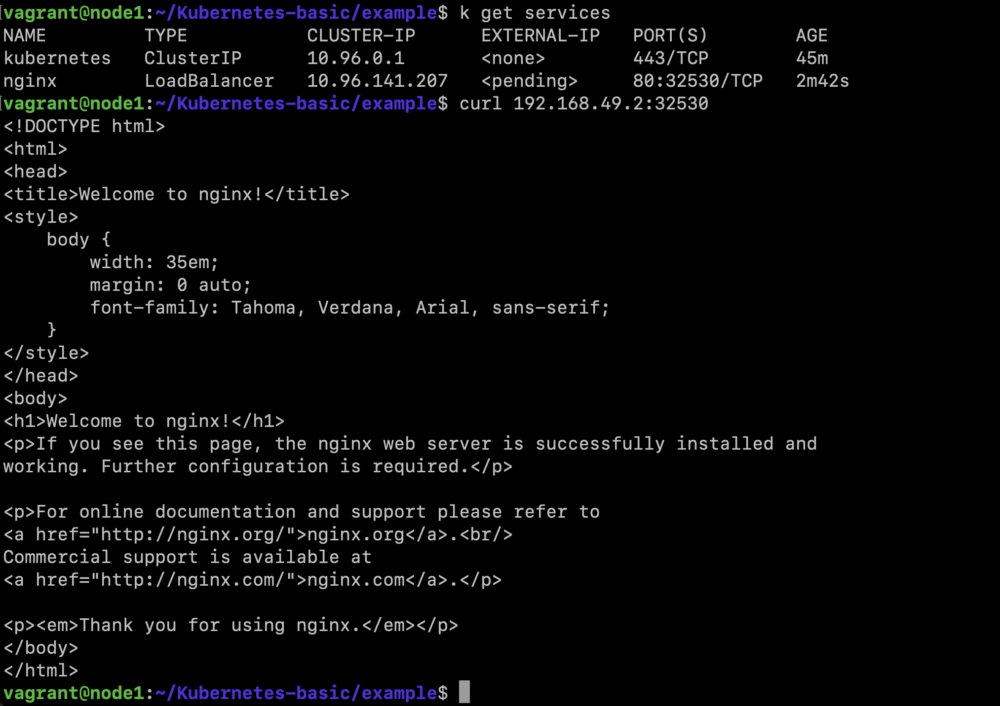
> ./src/example/nginx.yml

#### 3. Run the standard Kubernetes control panel with the minikube dashboard
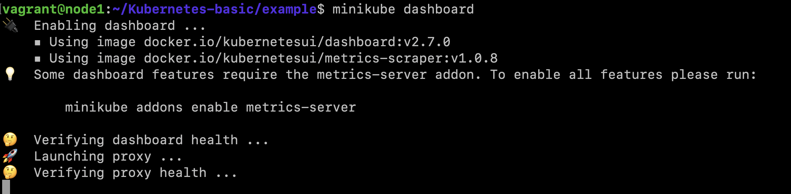
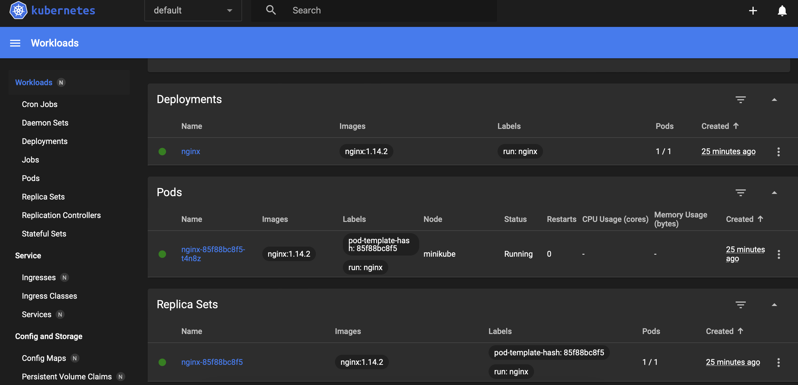

#### 4. Create tunnels to access the deployed services with the command minikube services
#### 5. Check if the deployed application works by opening the application page in the browser (nginx service)
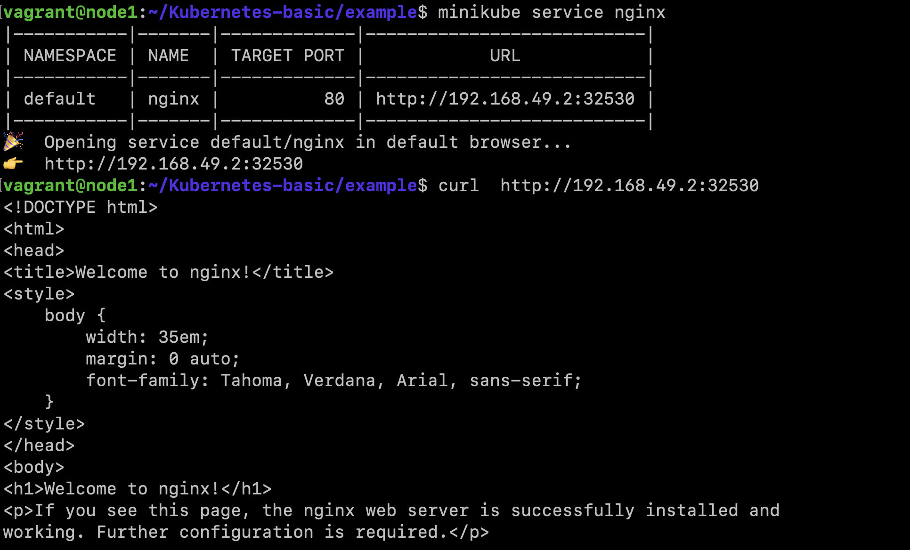

## Part 2. Your own manifest

#### 1. Write your own yml-files of manifests for the application from the first project (/src/services) implementing the following:
- Configuration map with the values of database hosts and services.
- Secrets with the password and login to the database.
- Pods and services for all application modules: postgres, rabbitmq and 7 application services. Use a single replica for all services.
> Check the ./src/k8s-configs directory

#### 2. Run the application by sequentially applying manifests with the command kubectl apply -f <manifest>.yaml.
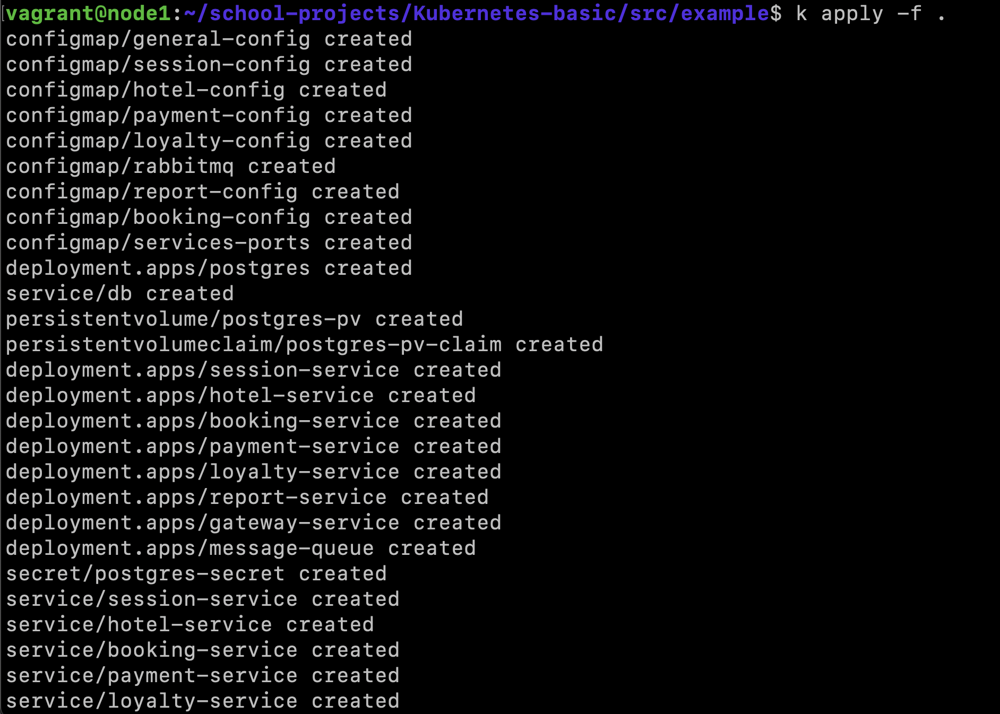

#### 3. Check the status of created objects (secrets, configuration map, pods and services) in the cluster using kubectl get <object_type> <object_name> and kubectl describe <object_type> <object_name>. 
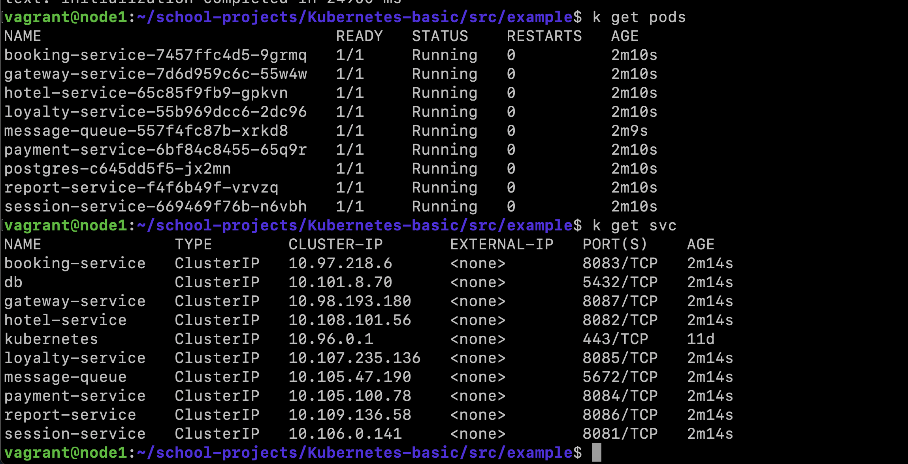
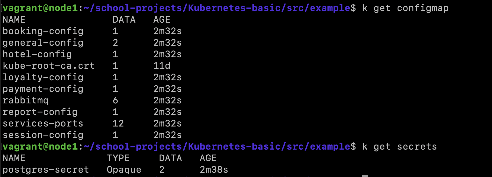

#### 4. Check for correct secret values by applying, for example, the command: kubectl get secret my-secret -o jsonpath='{.data.password}' | base64 --decode to decode the secret.
> I have the same password and login for postgres database 
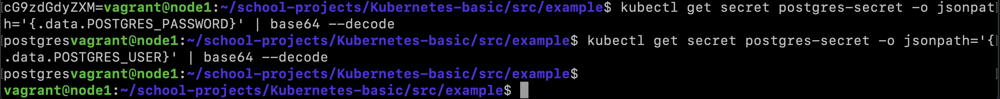

#### 5. Check the logs of the application running in the cluster with the command kubectl logs <container_name>
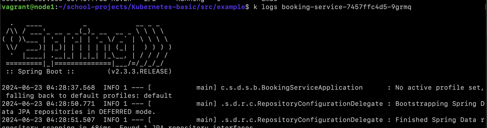
> ETC...

#### 6. Create tunnels to access the gateway service and session service.
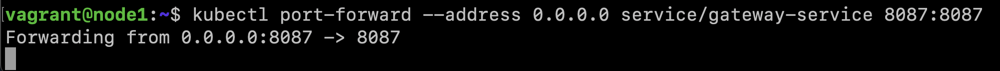
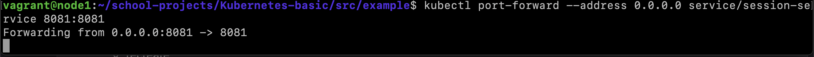

#### 7. Run postman functional tests and make sure that the application works.
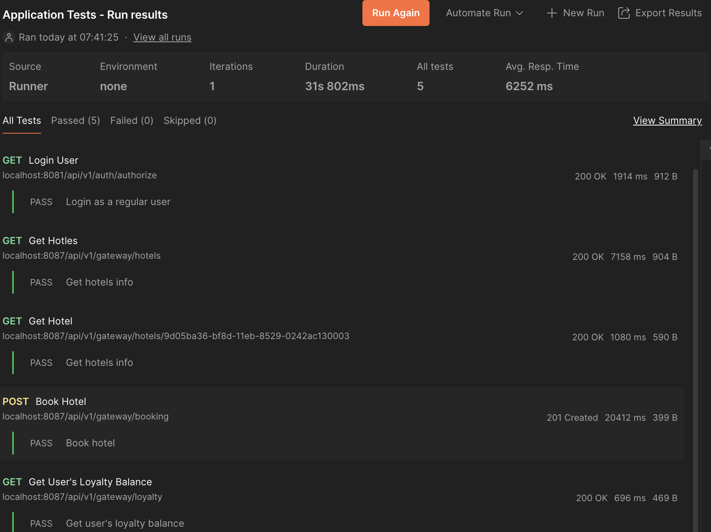

#### 8. Run the standard Kubernetes control panel with the command minikube dashboard. Include the following information in the report as screenshots from the dashboard: the current state of the cluster nodes, a list of running Pods, and other metrics such as CPU and memory utilization, Pod logs, configurations on the Pod and secrets.
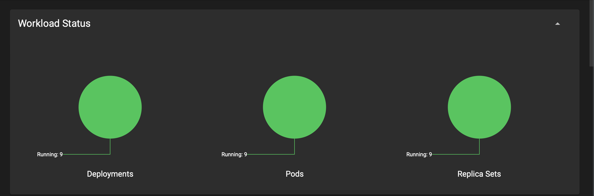

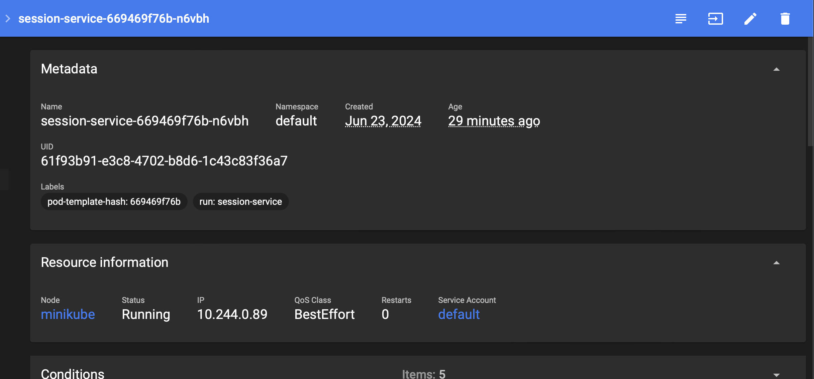
> ETC... 

#### 9. Rebuild the application with the following deployment strategies:
- recreate
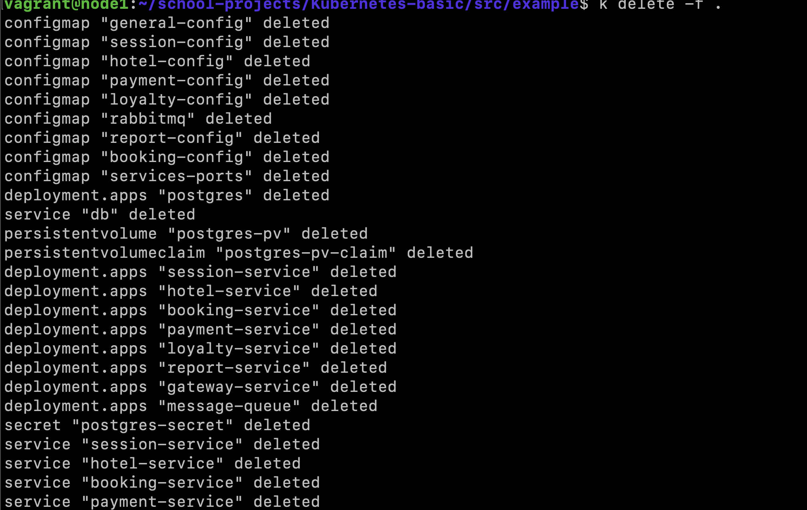
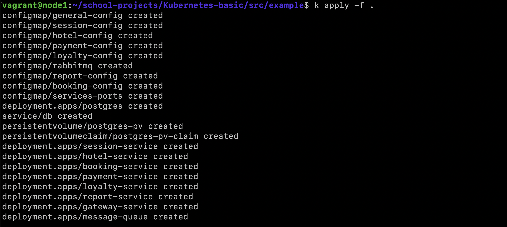
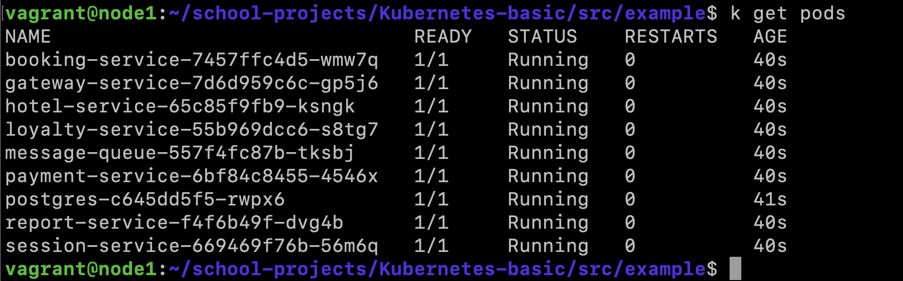
> Less than a minute 
- rolling

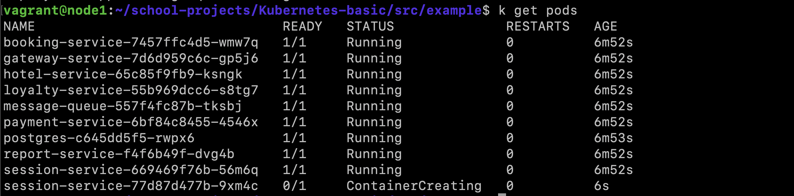
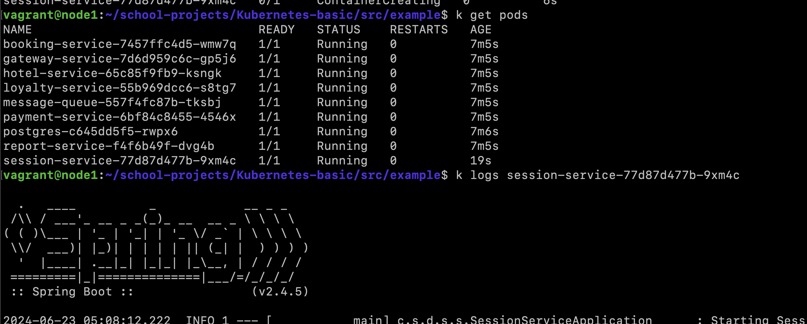

